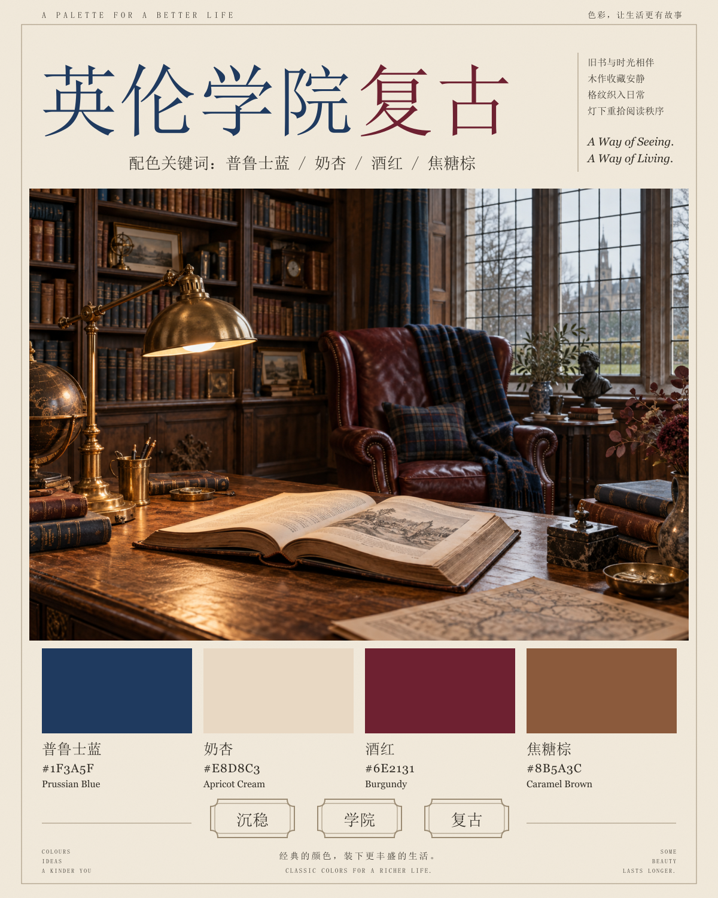

# Visual Almanac · 海报生成规范 v1

目标：新增任何视觉风格时，保持同一套档案海报结构。本文区分已观察到的共性与后续统一采用的规范；坐标是按参考图估读后归一化的设计约束，不是原文件的排版源数据。

## 1. 标准母版

统一版式示例：[英伦学院复古海报](../public/images/originals/british-academia-poster.png)。网站海报由 `scripts/render-posters.ts` 固定排版；该图展示标题层级、右侧边栏、四列配色和三枚底部标签。



最初的 12 张复古原图均为 1122 × 1402，版式存在差异。2026-09-10 已重新生成这 12 种风格的中央场景，以同一渲染器替换旧海报。当前全部 40 张海报统一使用 **4:5 竖版、1200 × 1500 的设计坐标**。模板技能自带的历史参考图独立保留，不作为网站图片提供。

每次生成必须附上同一母版 PNG。可以额外附一张新风格参考，但要明确：母版负责布局，新参考只影响中央场景。不要以上次生成的新图继续作为母版，避免逐次漂移。

## 2. 固定层与可变层

| 必须固定                           | 随风格替换                     |
| ---------------------------------- | ------------------------------ |
| 4:5 竖版、正视平面海报、完整画布   | 风格名称和标题分色             |
| 奶油纸色外底、低强度纸纹、细线框   | 四种主题色、色名、英文名和 HEX |
| 左上大标题、右上短文的双区结构     | 中央场景、物件、材质和灯光     |
| 单幅中央场景的位置、大小和矩形边界 | 右侧四行中文、两行英文短句     |
| 四列等宽色卡及标签的顺序           | 三枚标签的文字，各 2–4 个汉字  |
| 三枚标签的形状、行距、数量         | 场景的写实、插画或数字渲染媒介 |
| 顶部刊头、底部微文案、装饰规则     | 场景的情绪、空间与视觉重点     |

**固定的是档案馆的编辑版式，不是英伦书房内容。** 不把复古、木质、暗光、酒红强行套给未来主义、极简或其他新风格。外层纸张仍保持系列辨识度，中央画面遵从新风格。主题色必须人工确认后作为输入，不让生成模型自行改 HEX。

## 3. 版式网格

坐标以画布左上角为原点，X 按宽度百分比、Y 按高度百分比。以下为建议锁定值；AI 出图按视觉对齐检查，最终确定性排版才能严格控制像素。

| 区域         | X / Y                  | 宽 / 高          | 1200 × 1500 对应位置与约束                          |
| ------------ | ---------------------- | ---------------- | --------------------------------------------------- |
| 细线外框     | 3% / 2.7%              | 94% / 95.7%      | x36、y41，约宽1128、高1435；四角简洁                |
| 顶部英文刊头 | 5.8% / 1.2%            | 53% / 1.4%       | 小号衬线、大字距；贴近上框线内侧                    |
| 顶部中文刊头 | 76.5% / 1.2%           | 19% / 1.4%       | 右对齐，小字，不与主标题竞争                        |
| 主标题       | 5.5% / 4.5%            | 73.5% / 11.5%    | x66、y68；始终单行，限制在边栏左侧                  |
| 配色关键词行 | 5.5% / 17.1%           | 73.5% / 2.4%     | x66、y257；居中，四个色名与下面色卡一致             |
| 右上文案栏   | 81.5% / 6.0%           | 14.5% / 13.3%    | x978、y90；左侧细竖线，中文四行、英文两行           |
| 中央场景     | 4.1% / 21.0%           | 91.8% / 50.3%    | x49、y315，约宽1102、高755；横向约1.46:1            |
| 四张色卡     | 5.8% / 72.2%           | 每列20.9% / 9.5% | 首列x70、y1083；四列起点为5.8%、28.3%、50.8%、73.3% |
| 色卡文字区   | 与色卡左边缘齐 / 82.4% | 每列20.9% / 5.0% | 每列依次中文色名、HEX、英文色名；不要放进色块中     |
| 三枚装饰标签 | 29.3% / 89.0%          | 每枚11.7% / 4.3% | 中心约35.2%、50.1%、65.0%；相同尺寸与双线描边       |
| 底部中心文案 | 31% / 94.5%            | 38% / 2.4%       | 中文一行、英文一行，居中                            |
| 左右角微文案 | 5.8%、88.0% / 94.2%    | 6.2% / 3.2%      | 每侧三行，分别左/右对齐                             |

各区域不可相互侵入。主标题再长也不能挤占中央图；场景不加圆角，不做九宫格、拼贴或满版出血。原图间存在小幅位置波动，新模板以本规范统一。

## 4. 字体、颜色与装饰

- 标题：粗宋体/高对比衬线的视觉气质，不声称已识别原图具体字体。约占画布宽度的10%–14%作为初始字号；6–8字较大，9–12字缩小，始终保持一行。超过12字改用展示短名，完整名称记录在网站数据中。
- 标题用两个连续分色片段，最多三色。后缀可为“复古”“风格”或名称中的自然片段，不强制每种风格带“复古”。分色边界由输入指定，不拆散词义。
- 关键词行约26–30px，中文短文约15–17px，英文短句约21–24px斜体，色名约23–26px，HEX约18–20px，页脚约10–12px（均以1200宽为基准）。这些是排版参考，文字应优先清楚而非机械追求字号。
- 外底建议 `#F1E9DA`，正文建议 `#302C25`，装饰线建议 `#9B8B73`；它们是为统一系列而设的模板颜色，不是从所有原图测得的精确共同值。
- 细线框、三枚标签、少量花饰保持细而轻，不新增大面积金箔、火漆、邮票、徽章或品牌标志。四列色卡形状和间距相同。
- 原作色块有轻微剪影与纸纹。兼容生成时只允许低对比、低覆盖的肌理，禁止遮住主体颜色；若追求色值准确，最终色卡应在排版阶段直接以 HEX 填充，并把装饰限制在色块边缘。

## 5. 中央场景规则

画面要让人一眼感受到风格，突出一个视觉中心、两到三层景深、三种以内关键材质和少量识别物件。明确前景、中景、背景，而非罗列几十种物品。

场景可为室内、街景、静物或数字构成；现有海报以空间场景为主，若新风格无需空间表达，可换媒介，但保持同一个中央矩形和四周版式。避免无关文字、虚构品牌和醒目水印。场景内必要招牌只作为环境细节，不重复海报大标题。

四种颜色应在场景中形成可感知呼应，不要求四种颜色各占25%；色卡等宽是排版规则，并非面积统计。纸张底色不自动计入主题四色。

## 6. 输入变量与直接生成提示词

- [通用提示词母版](../templates/posters/prompt.template.md)：可复制到任意支持参考图的生成工具。
- [北欧极简填写示例](../templates/posters/examples/nordic-minimal.json)：演示一种非复古风格如何使用同一外框。
- `npm run poster:prompt -- templates/posters/examples/nordic-minimal.json`：检查参数并在终端输出完整提示词。
- `npm run poster:prompt -- templates/posters/examples/nordic-minimal.json artifacts/nordic-prompt.md`：保存为文件；此时再将母版 PNG 与提示词一起交给生成工具。

命令只准备文字，不调用生成 API，不产生新海报，也不把示例加入线上档案。参数固定为四种颜色、三枚标签、四行中文边栏、两行英文短句。结构错误会返回明确提示。

## 7. 固定微文案

顶部左：`A PALETTE FOR A BETTER LIFE`

顶部右：`色彩，让生活更有故事`

关键词前缀：`配色关键词：`

底部中心中文：`经典的颜色，装下更丰盛的生活。`

底部中心英文：`CLASSIC COLORS FOR A RICHER LIFE.`

左下角三行：`COLOURS` / `IDEAS` / `A KINDER YOU`

右下角三行：`SOME` / `BEAUTY` / `LASTS LONGER.`

这些从母版提取后固定；不把原图中偶发的英文拼写、标点漂移当作需要复刻的特征。边栏四行中文和两行英文是新风格输入，不固定使用“Old Books”。

## 8. 两种生产方式

**直接生成整张海报**：提供标准母版、填写后的提示词和已确认文字。适合持续积累参考图；生成完成逐项检查，必要时让工具只修正错误区域。参考图和约束可减少漂移，不能保证中文、数字或几何位置完全准确。

**场景生成 + 固定排版**：若要长期严格一致，只生成中央场景（约1102×755比例，不含文字），把外框、标题、HEX、色卡和标签放入固定的矢量或代码排版母版。色值与排版由程序/设计软件控制。现已通过 `scripts/render-posters.ts` 实现固定 SVG 排版，详见下方命令；场景由 imagegen 独立生成，程序负责文字、色卡和版式。

两种方式都保留一份结构化颜色输入。网站 JSON 以已确认的输入为准，再核对图片文字；若图文不一致先修图，不根据模型误写的 HEX 反向覆盖原始颜色数据。原作中的近似取样色值不自动升级为已核对值。

## 9. 出图验收清单

1. 单张4:5竖版、正面平面图，无相框展示场景、无斜视透视、无裁掉边框。
2. 标题左、短文右；标题单行、拼写正确、没有侵入边栏或主图。
3. 中央只有一幅场景，占约半张海报高度，位置与母版一致。
4. 四列色卡数量、宽度、间距一致；关键词、色卡中文、HEX、英文逐列对应且顺序一致。
5. 三枚标签保持固定位置和形状，没有第四枚标签或重复文字。
6. 所有中文和 HEX 对照输入逐字检查；小字不能以乱码糊弄。
7. 场景表现目标审美，而非只替换标题后继续画英伦书房。
8. 与母版同尺寸并排查看，检查区块顶边、底边与留白；位置偏差明显则修正。
9. 以网站卡片尺寸和原图尺寸各看一次，确认整体统一且细节可读。

全部 40 张海报已按“场景生成 + 固定排版”制作（第一批 16 张、第二批 12 张、复古重制 12 张）。固定排版保证文本和色卡采用输入值，场景是否准确表达风格仍需人工检查。

## 10. 固定排版命令

```bash
npm run poster:render
# 也可指定包含多份配方 JSON 的目录及输出目录
npm run poster:render -- templates/posters/batch-one artifacts/poster-preview

# 第二批：沿用同一排版器，只切换配方目录
npm run poster:render -- templates/posters/batch-two

# 复古分类：重建 12 张统一版式海报
npm run poster:render -- templates/posters/retro
npm run images
node scripts/verify-retro-posters.mjs
```

默认读取 `templates/posters/batch-one/*.json`，将 `assets/poster-scenes/*.png` 嵌入标准版式，生成 `public/images/originals/<styleId>-poster.png`。命令只重建所选目录配方中的同名输出。无需重新调用生成服务。复古配方位于 `templates/posters/retro/`，场景由内置图像生成工具制作，既有配色数值保持不变；旧图的取样来源在档案配色说明中保留。配方保留场景提示词、标题分色、四种颜色、三枚标签与边栏文案；色名和 HEX 必须与对应档案首组配色一致，否则停止。

浅色主题可在配方中指定 `titleColors: ["#6B5540", "#8D6070"]`，分别用于标题前段与后段，避免标题与奶油纸底对比不足。不设置时沿用原有主题色推导；此配置只控制标题墨色，不修改档案四种色卡。`accentLength` 按完整词组设置，例如“朋克 / 自出版”的后段为 3 个字。

此配方供固定渲染器使用，与 `poster:prompt` 的完整生成参数格式不同。输出统一为 1200 × 1500，调试 SVG 保存在忽略目录 `artifacts/poster-svg/`。渲染使用系统宋体（SimSun，备选 Noto Serif CJK SC）；其他平台重建时先安装中文字体。普通构建直接使用已提交的 PNG，无需字体或生成服务。
